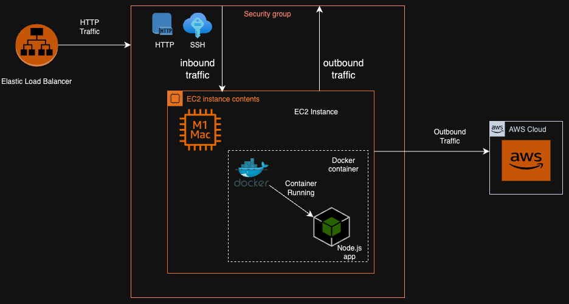

# Deploying a Node.js TypeScript Backend with Docker to EC2

## Core AWS Services Used

### Compute
- **EC2**: Amazon Elastic Compute Cloud (EC2) is one of the popular AWS services providing scalable cloud computing capacity. It launches virtual servers and manages their configurations, storage, and networking. It offers numerous features for deploying your applications. Some of its key features include:
  - **Amazon Machine Image (AMI)**: Pre-configured templates for your instances.
  - **Instance Types**: Various instance types tailored to different workloads.
  - **User Data**: Scripts and commands to run at instance launch.
  - **Security Groups**: Virtual firewalls to control inbound and outbound traffic.
  - **Elastic Block Store (EBS) Volumes**: Persistent block storage for your instances.
  - **EBS Snapshots**: Backup of your EBS volumes.
  - **Elastic Load Balancing (ELB)**: Distributes incoming traffic across multiple instances.

## Key Concepts
- **Containerization**: It involves the packaging of an application and its dependencies into a container to ensure consistency across multiple environments.
- **EC2 Setup**: Steps involved in launching and configuring an EC2 instance to host applications.
- **Docker Deployment**: Using Docker to create, deploy, and manage containers on EC2 instances.

## Project Overview

### Introduction
- **Purpose**: This backend project is a fully functional application that generates technical documentation for users. It includes authentication and authorization for users, allows users to add and manage projects, and provides an AI feature for generating documentation. The project aims to showcase the deployment process of a Node.js backend application using Docker and AWS EC2.
- **Tech Stack Used**: Node.js, TypeScript, Mongodb, Docker, AWS EC2.
- **GitHub Link**: [Node.js TypeScript Docker EC2 Repository](https://github.com/yourusername/nodejs-typescript-docker-ec2)

### Architecture Diagram and Patterns Used
- **Architecture Diagram**:
  
 

- **Patterns Used**: Microservices, Containerization.

### Project Setup and Configuration
- **Setup Instructions**:
  - **Docker Setup**: 
    - Create a Dockerfile and build Docker images.
    - Write a docker-compose.yml for multi-container setups.
  - **EC2 Setup**:
    - Launch an EC2 instance using the AWS Management Console.
    - Configure inbound rules to allow HTTP and SSH access.
    - SSH into the instance and install Docker.
    - Pull and run Docker images on the EC2 instance.
  - **Deployment**:
    - Deploy Docker containers on EC2.

### Key Learnings
- Understanding the deployment process using Docker and EC2.
- Configuring EC2 security groups for secure application deployment.
- Integrating various AWS services for a seamless deployment experience.

